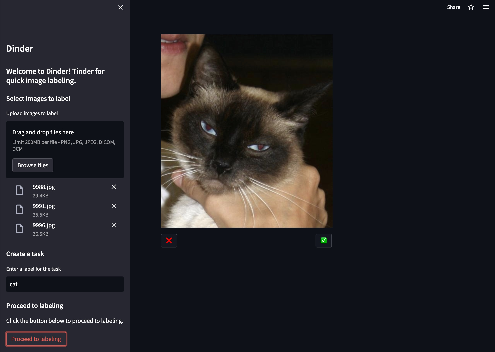

# Dinder



Deployed app: https://szkocot-dinder-app-avfitf.streamlit.app/

# Description

Dinder is a Tinder-inspired app for simplified image annotation. It allows users to creare project, select images and decide if the image has a certain label or not, for example hot or not hot and save results as csv. The app is built with Steamlit. It supports typical image formats such as jpg, png, jpeg as well as DICOM images.

# Installation

To install the app, run the following command:

```bash
pip install -r requirements.txt
```

# How to use
Run the following command to start the app:

```bash
streamlit run app.py
```

# License
MIT License

# Author
Szymon Kocot